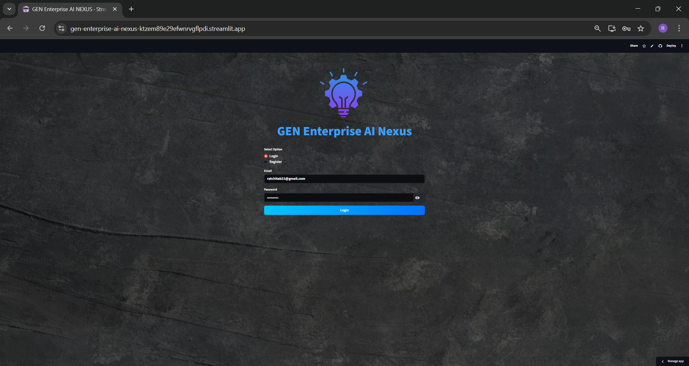
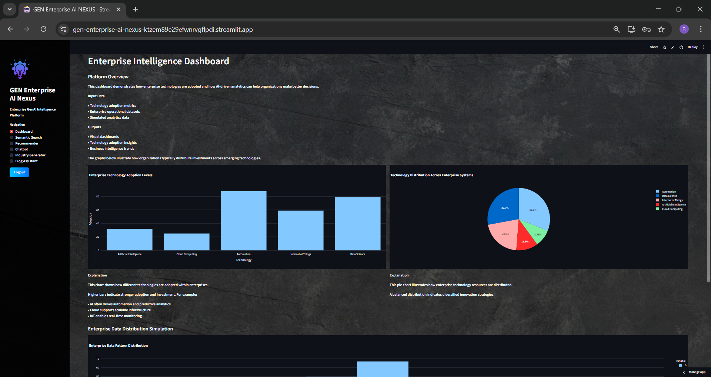
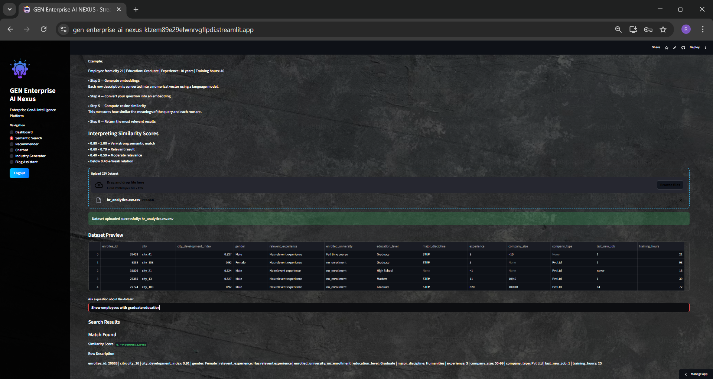
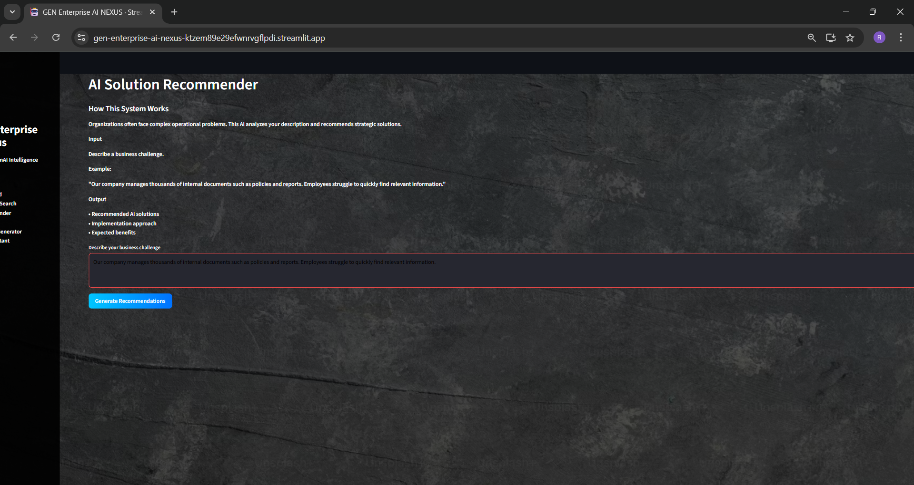
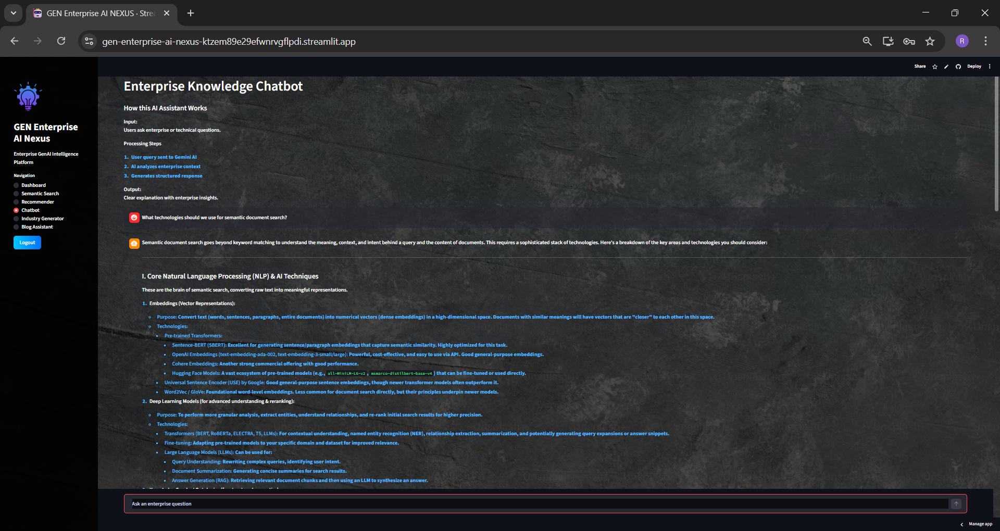
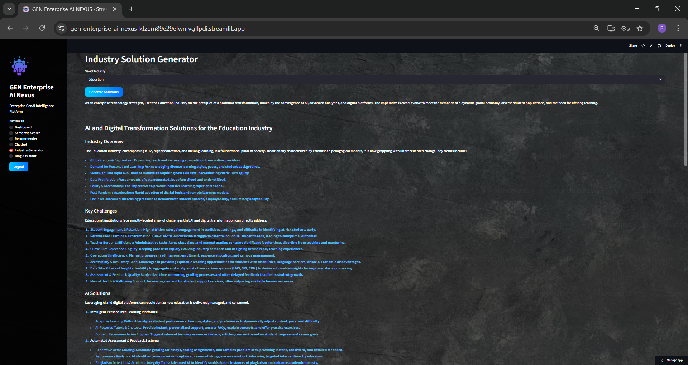
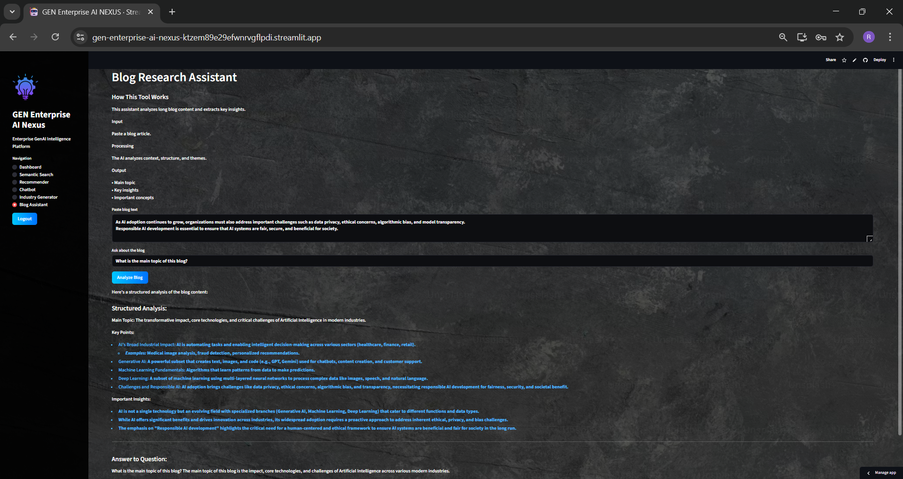

# 🚀 GEN Enterprise AI Nexus


---

# 🌐 Live Application

🔗 **Streamlit Deployment**

https://https://gen-enterprise-ai-nexus-ktzem89e29efwnrvgflpdi.streamlit.app/

---

# 📌 Project Overview

**GEN Enterprise AI Nexus** is an **Enterprise Generative AI Intelligence Platform** designed to demonstrate how organizations can integrate **AI assistants, semantic search, intelligent recommendations, and analytics dashboards** into a unified AI system.

This platform simulates a **real-world enterprise AI ecosystem** where businesses can:

• Discover insights from enterprise data
• Search information using semantic AI
• Generate AI-driven strategic recommendations
• Analyze data through intelligent dashboards
• Extract knowledge from unstructured text

The project demonstrates **practical applications of Generative AI in enterprise environments**.

---

# 🧠 Key Features

## 🔐 Secure Authentication

User authentication system including:

• Login and Registration
• Secure password hashing with **bcrypt**
• Session-based authentication
• Protected AI modules

---

## 📊 Enterprise Intelligence Dashboard

Interactive analytics dashboard demonstrating enterprise technology adoption.

Features:

• Technology adoption visualization
• Enterprise analytics simulation
• Interactive **bar charts and pie charts**
• Data insights using **Plotly**

Technologies used:

* Pandas
* Plotly
* Streamlit

---

## 🔎 Semantic Search Engine

Machine learning powered **semantic search system** that retrieves relevant data based on **meaning rather than keywords**.

### Pipeline

1. Upload enterprise dataset (CSV)
2. Convert rows into descriptive text
3. Generate **sentence embeddings**
4. Compute **cosine similarity**
5. Retrieve most relevant results

Technologies:

• Sentence Transformers
• Embeddings
• Cosine Similarity
• Scikit-learn

---

## 🤖 Enterprise Knowledge Chatbot

AI assistant powered by **Google Gemini API**.

Capabilities:

• Answer enterprise questions
• Generate structured AI responses
• Provide technical explanations
• Maintain conversation history

Technologies:

• Google Gemini
• Prompt Engineering
• Streamlit Chat Interface

---

## 💡 AI Solution Recommender

AI system that analyzes **business problems** and suggests **AI implementation strategies**.

Example challenge:

"Our company struggles to search internal documents."

AI Output:

• Recommended AI solution
• Implementation roadmap
• Expected enterprise benefits

---

## 🏭 Industry Solution Generator

Generates **AI transformation strategies for different industries**.

Supported industries:

• Education
• Healthcare
• Finance
• Retail
• Manufacturing

Provides:

• Industry overview
• Key challenges
• AI solutions
• Digital transformation strategies

---

## 📝 Blog Research Assistant

AI-powered tool for analyzing blog content.

Capabilities:

• Extract main topic
• Identify key insights
• Summarize complex text
• Generate structured analysis

Useful for **content research and knowledge extraction**.

---

# 🏗️ System Architecture

```
User Interface (Streamlit)

        │
        ▼

Enterprise AI Platform

        │
        ▼

AI Modules
• Semantic Search
• AI Recommender
• Chatbot
• Blog Analyzer
• Industry Generator

        │
        ▼

AI Models & APIs
• Google Gemini
• Sentence Transformers
• Machine Learning

        │
        ▼

Data Processing
• Pandas
• NumPy
• Scikit-learn
```

---

# 🛠️ Tech Stack

### Frontend

Streamlit UI
Custom CSS Styling

### Backend

Python

### Artificial Intelligence

Google Gemini API
Sentence Transformers
Transformers (HuggingFace)

### Machine Learning

Embeddings
Cosine Similarity
Scikit-learn

### Data Processing

Pandas
NumPy

### Visualization

Plotly
Seaborn

### Authentication

bcrypt password hashing

---

# 📂 Project Structure

```
GEN-ENTERPRISE-AI-NEXUS
│
├── app.py
│
├── auth
│   ├── auth_ui.py
│   ├── auth_db.py
│   └── users.json
│
├── modules
│   ├── dashboard.py
│   ├── semantic_search.py
│   ├── chatbot.py
│   ├── recommender.py
│   ├── industry_generator.py
│   └── blog_assistant.py
│
├── utils
│   ├── embeddings.py
│   ├── cosine_similarity.py
│   ├── vector_store.py
│   ├── chat_memory.py
│   └── data_loader.py
│
├── config
│   └── config.py
│
├── chat_memory
│   └── history.json
│
├── requirements.txt
└── README.md
```

---

# 📸 Application Screenshots

### Login



### Dashboard



### Semantic Search



### AI Recommender



### Enterprise Chatbot



### Industry Generator



### Blog Research Assistant



---

# ⚙️ Installation

### Clone repository

```
git clone https://github.com/22AD040/gen-enterprise-ai-nexus.git
```

---

### Navigate to project

```
cd gen-enterprise-ai-nexus
```

---

### Create virtual environment

```
python -m venv venv
```

Activate environment

Windows

```
venv\Scripts\activate
```

Mac/Linux

```
source venv/bin/activate
```

---

### Install dependencies

```
pip install -r requirements.txt
```

---

### Add Gemini API Key

Create `.env`

```
GEMINI_API_KEY=your_api_key_here
```

---

### Run application

```
streamlit run app.py
```

---

# 🚀 Future Enhancements

Potential improvements:

• Vector databases (FAISS / Pinecone)
• Retrieval Augmented Generation (RAG)
• Enterprise document indexing
• Multi-user chat memory
• API integrations
• Enterprise deployment architecture

---

# 👩‍💻 Author

**Ratchita B**

GenAI Developer | Machine Learning Enthusiast

GitHub
https://github.com/22AD040

---

# 📜 License

MIT License
